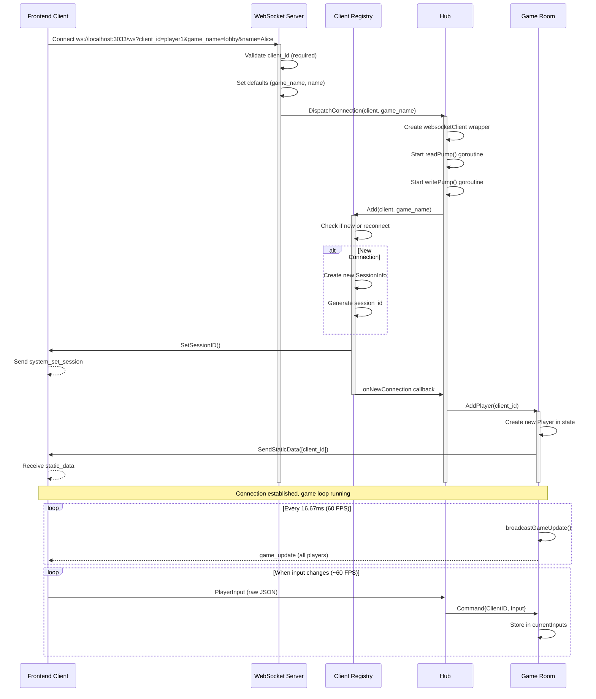
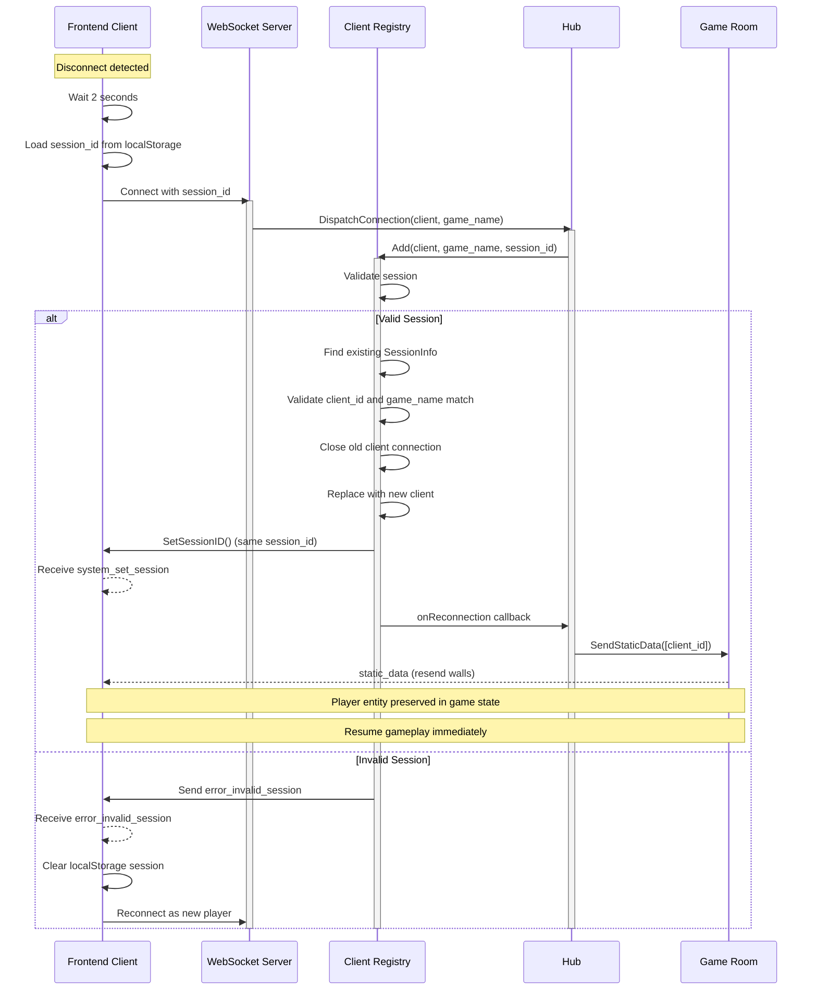
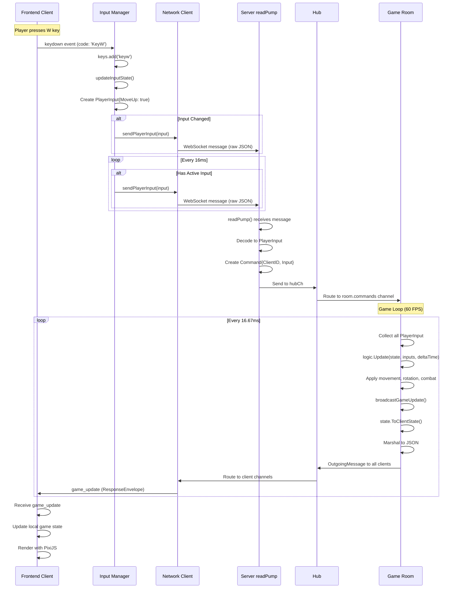
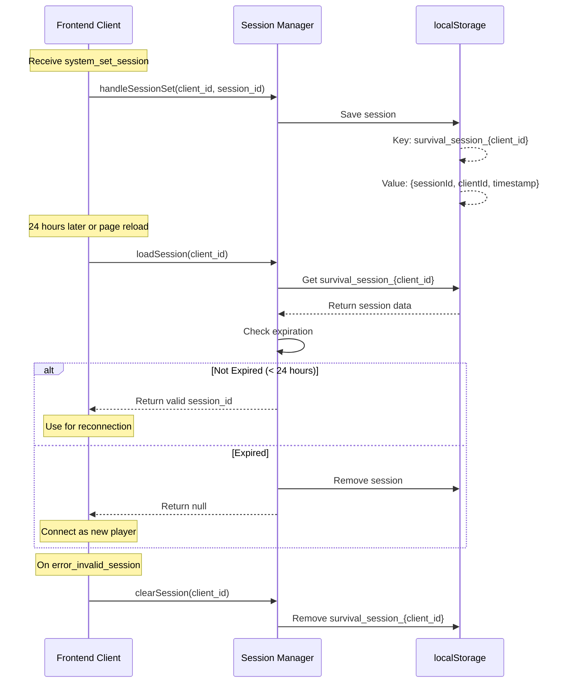

# WebSocket Protocol Specification

**Version**: 1.0
**Last Updated**: 2025-11-15
**Status**: Development Phase

## Table of Contents

1. [Overview](#overview)
2. [Connection Establishment](#connection-establishment)
3. [Message Types](#message-types)
4. [Communication Flows](#communication-flows)
5. [Protocol Differences & Issues](#protocol-differences--issues)
6. [Field Specifications](#field-specifications)

---

## Overview

This document specifies the WebSocket communication protocol between the Go backend server and TypeScript frontend client for the survival game.

### Architecture

- **Protocol**: WebSocket (JSON-based messages)
- **Server**: Go (port 3033)
- **Client**: TypeScript + PixiJS
- **Encoding**: JSON with UTF-8 text messages
- **Game Loop**: 60 FPS (16.67ms per tick)

### Key Characteristics

- **Server Authoritative**: All game logic runs on server
- **Asymmetric Envelopes**: Server wraps responses in envelopes, client sends raw input
- **Real-time Sync**: Game state broadcasted at 60 FPS
- **Session Persistence**: Support for reconnection via session IDs

---

## Connection Establishment

### WebSocket Endpoint

```
ws://localhost:3033/ws
```

### Connection Parameters (Query String)

| Parameter | Required | Default | Description |
|-----------|----------|---------|-------------|
| `client_id` | **Yes** | - | Unique client identifier |
| `game_name` | No | `"default_room"` | Game/room name to join |
| `name` | No | Same as `client_id` | Player display name |
| `session_id` | No | Empty string | For reconnection support |

### Example Connection URLs

**New Connection**:
```
ws://localhost:3033/ws?client_id=player1&game_name=lobby&name=Alice
```

**Reconnection**:
```
ws://localhost:3033/ws?client_id=player1&game_name=lobby&name=Alice&session_id=sess-abc123
```

---

## Message Types

### Client → Server Messages

#### PlayerInput (Raw JSON)

**Note**: Unlike server messages, client input is sent as **raw JSON without envelope wrapping**.

**Frequency**: ~60 FPS when input is active

**Structure**:
```typescript
{
  "MoveUp": boolean,       // W key
  "MoveDown": boolean,     // S key
  "MoveLeft": boolean,     // A key
  "MoveRight": boolean,    // D key
  "RotateLeft": boolean,   // Q key
  "RotateRight": boolean,  // E key
  "SwitchWeapon": boolean, // Tab key
  "Reload": boolean,       // R key
  "FastReload": boolean,   // Shift+R
  "Fire": boolean          // Space bar
}
```

**Example**:
```json
{
  "MoveUp": true,
  "MoveDown": false,
  "MoveLeft": false,
  "MoveRight": true,
  "RotateLeft": false,
  "RotateRight": false,
  "SwitchWeapon": false,
  "Reload": false,
  "FastReload": false,
  "Fire": false
}
```

**Backend Files**:
- Definition: `/home/user/survival_game/internal/protocol/protocol.go:49-60`
- Handler: `/home/user/survival_game/internal/app/client.go` (readPump)

**Frontend Files**:
- Definition: `/home/user/survival_game/frontend/src/state.ts:43-54`
- Sender: `/home/user/survival_game/frontend/src/input.ts:99-106`

---

### Server → Client Messages

All server messages are wrapped in a **ResponseEnvelope**:

```typescript
{
  "envelope_type": string,  // Message type identifier
  "payload": any            // Message-specific payload
}
```

#### 1. game_update

**EnvelopeType**: `"game_update"`
**Frequency**: 60 FPS (every 16.67ms)
**Purpose**: Broadcast current game state to all clients

**Payload Structure** (`ClientGameState`):
```typescript
{
  "players": {
    [player_id: string]: {
      "ID": string,
      "Position": { "x": number, "y": number },
      "Direction": number,           // Radians
      "Radius": number,
      "RotationSpeed": number,       // Radians per second
      "MovementSpeed": number,       // Pixels per second
      "Health": number,
      "IsAlive": boolean,
      "Inventory": Inventory | null,
      "CurrentWeapon": Weapon | null
    }
  },
  "walls": [
    {
      "id": string,
      "center": { "x": number, "y": number },
      "half_size": { "x": number, "y": number },
      "rotation": number             // Radians
    }
  ],
  "projectiles": [
    {
      "ID": string,
      "Position": { "x": number, "y": number },
      "Direction": { "x": number, "y": number },  // Unit vector
      "Speed": number,               // Pixels per second
      "Range": number,               // Max travel distance
      "Damage": number,
      "OwnerID": string
    }
  ],
  "timestamp": number                // Unix timestamp in milliseconds
}
```

**Example**:
```json
{
  "envelope_type": "game_update",
  "payload": {
    "players": {
      "player-1": {
        "ID": "player-1",
        "Position": { "x": 100.5, "y": 200.3 },
        "Direction": 1.57,
        "Radius": 0.5,
        "RotationSpeed": 4.0,
        "MovementSpeed": 120,
        "Health": 100,
        "IsAlive": true,
        "Inventory": null,
        "CurrentWeapon": null
      }
    },
    "walls": [
      {
        "id": "wall-1",
        "center": { "x": 400, "y": 300 },
        "half_size": { "x": 50, "y": 100 },
        "rotation": 0
      }
    ],
    "projectiles": [],
    "timestamp": 1731686400000
  }
}
```

**Backend Files**:
- Definition: `/home/user/survival_game/internal/game/state.go:128-133`
- Sender: `/home/user/survival_game/internal/game/room.go:177-183`

**Frontend Files**:
- Definition: `/home/user/survival_game/frontend/src/state.ts:31-35`
- Handler: `/home/user/survival_game/frontend/src/network.ts:104-118`

---

#### 2. static_data

**EnvelopeType**: `"static_data"`
**Frequency**: Once on connection
**Purpose**: Send map layout and static objects to new client

**Payload Structure** (`StaticGameData`):
```typescript
{
  "type": "staticData",
  "walls": [
    {
      "id": string,
      "center": { "x": number, "y": number },
      "half_size": { "x": number, "y": number },
      "rotation": number
    }
  ],
  "mapWidth": number,
  "mapHeight": number
}
```

**Example**:
```json
{
  "envelope_type": "static_data",
  "payload": {
    "type": "staticData",
    "walls": [
      {
        "id": "wall-1",
        "center": { "x": 100, "y": 150 },
        "half_size": { "x": 10, "y": 75 },
        "rotation": 0
      }
    ],
    "mapWidth": 800,
    "mapHeight": 600
  }
}
```

**Backend Files**:
- Definition: `/home/user/survival_game/internal/game/messages.go:30-36`
- Sender: `/home/user/survival_game/internal/game/room.go` (SendStaticData)

**Frontend Files**:
- Definition: `/home/user/survival_game/frontend/src/state.ts:37-41`
- Handler: `/home/user/survival_game/frontend/src/network.ts:120-128`

---

#### 3. system_set_session

**EnvelopeType**: `"system_set_session"`
**Frequency**: Once on connection/reconnection
**Purpose**: Inform client of assigned session ID for reconnection support

**Payload Structure**:
```typescript
{
  "client_id": string,
  "session_id": string
}
```

**Example**:
```json
{
  "envelope_type": "system_set_session",
  "payload": {
    "client_id": "player1",
    "session_id": "sess-abc123"
  }
}
```

**Backend Files**:
- Definition: `/home/user/survival_game/internal/protocol/protocol.go:66-69`
- Sender: `/home/user/survival_game/internal/app/client.go` (SetSessionID)

**Frontend Files**:
- Handler: `/home/user/survival_game/frontend/src/network.ts:130-142`
- Session Manager: `/home/user/survival_game/frontend/src/session.ts`

---

#### 4. system_notify

**EnvelopeType**: `"system_notify"`
**Frequency**: As needed
**Purpose**: Send system notifications to clients

**Payload Structure**:
```typescript
{
  "message": string
}
```

**Example**:
```json
{
  "envelope_type": "system_notify",
  "payload": {
    "message": "Player3 has joined the game"
  }
}
```

**Backend Files**:
- Definition: `/home/user/survival_game/internal/protocol/protocol.go:62-64`

**Frontend Files**:
- Handler: `/home/user/survival_game/frontend/src/network.ts:144-151`

---

#### 5. error_invalid_session

**EnvelopeType**: `"error_invalid_session"`
**Frequency**: On session validation failure
**Purpose**: Inform client that session is invalid/expired

**Payload Structure**:
```typescript
{
  "message": string
}
```

**Example**:
```json
{
  "envelope_type": "error_invalid_session",
  "payload": {
    "message": "Session validation failed"
  }
}
```

**Backend Files**:
- Sender: `/home/user/survival_game/internal/infrastructure/network/websocket/server.go`

**Frontend Files**:
- Handler: `/home/user/survival_game/frontend/src/network.ts:153-165`

---

## Communication Flows

### New Connection Flow



### Reconnection Flow



### Game Loop and Input Processing



### Session Persistence Flow



---

## Protocol Differences & Issues

### Critical Issues

#### 1. **[CRITICAL] Input Key Mapping Bug**

**Location**: `/home/user/survival_game/frontend/src/input.ts:51-60`

**Issue**: Key codes are incorrectly mapped in input detection.

**Current (Broken) Code**:
```typescript
const newInput: PlayerInput = {
  MoveUp: this.keys.has('keys'),      // ❌ WRONG! Should be 'keyw'
  MoveDown: this.keys.has('keyw'),    // ❌ WRONG! Should be 'keys'
  MoveLeft: this.keys.has('keya'),    // ✓ Correct
  MoveRight: this.keys.has('keyd'),   // ✓ Correct
  RotateLeft: this.keys.has('keyq'), // ✓ Correct
  RotateRight: this.keys.has('keye'), // ✓ Correct
  // ...
  Fire: this.keys.has('space')        // ✓ Correct
};
```

**Problem**:
- Line 29 stores `event.code.toLowerCase()` → `'keyw'`, `'keys'`, etc.
- But MoveUp checks for `'keys'` instead of `'keyw'`
- MoveDown checks for `'keyw'` instead of `'keys'`
- This causes W/S keys to be swapped!

**Correct Fix**:
```typescript
const newInput: PlayerInput = {
  MoveUp: this.keys.has('keyw'),      // ✓ W key
  MoveDown: this.keys.has('keys'),    // ✓ S key
  // ... rest unchanged
};
```

**Impact**: Players cannot move correctly. W key moves down, S key moves up.

---

#### 2. **[HIGH] Projectile Field Name Mismatch**

**Backend** (`internal/game/weapons.go:94-102`):
```go
type Projectile struct {
    ID        string
    Position  Vector2D
    Direction Vector2D    // ← Backend uses "Direction"
    Speed     float64
    Range     float64
    Damage    int
    OwnerID   string
}
```

**Frontend** (`frontend/src/state.ts:24-29`):
```typescript
export interface Projectile {
  ID: string;
  Position: Vector2D;
  Velocity: Vector2D;   // ← Frontend expects "Velocity"
  OwnerID: string;
}
```

**Problem**:
- Backend sends field named `Direction`
- Frontend expects field named `Velocity`
- This causes projectiles to have undefined velocity in frontend!

**Impact**: Projectile rendering will fail or show incorrect movement.

**Resolution Required**:
- Option A: Rename backend field to `Velocity`
- Option B: Rename frontend field to `Direction`
- Recommendation: Use `Velocity` (more semantically correct for physics)

---

#### 3. **[MEDIUM] Player Field Mismatch**

**Backend** (`internal/game/player.go:10-21`):
```go
type Player struct {
    ID            string
    Position      Vector2D
    Direction     float64
    Radius        float64
    RotationSpeed float64
    MovementSpeed float64
    Health        int
    IsAlive       bool
    Inventory     *Inventory      // ← Backend includes
    CurrentWeapon *Weapon         // ← Backend includes
}
```

**Frontend** (`frontend/src/state.ts:6-15`):
```typescript
export interface Player {
  ID: string;
  Position: Vector2D;
  Direction: number;
  Radius: number;
  RotationSpeed: number;
  MovementSpeed: number;
  Health: number;
  IsAlive: boolean;
  // Missing: Inventory, CurrentWeapon
}
```

**Problem**:
- Backend sends `Inventory` and `CurrentWeapon` in game updates
- Frontend interface doesn't declare these fields
- TypeScript will not provide type checking for these fields

**Impact**:
- Low immediate impact (fields simply ignored if not used)
- Future features using weapons/inventory will have type mismatches

**Resolution Required**: Add optional fields to frontend Player interface:
```typescript
export interface Player {
  // ... existing fields
  Inventory?: Inventory | null;
  CurrentWeapon?: Weapon | null;
}
```

---

#### 4. **[MEDIUM] Missing Projectile Fields in Frontend**

**Backend Projectile**: Has 7 fields (ID, Position, Direction, Speed, Range, Damage, OwnerID)
**Frontend Projectile**: Has 4 fields (ID, Position, Velocity, OwnerID)

**Missing Fields**:
- `Speed` (number)
- `Range` (number)
- `Damage` (number)

**Impact**:
- Cannot display projectile speed/damage in UI
- Cannot validate projectile behavior client-side

**Resolution Required**: Add missing fields to frontend interface.

---

### Design Decisions (Not Issues)

#### 5. **[INFO] Asymmetric Message Envelopes**

**By Design**: This is an intentional optimization.

- **Server → Client**: Wrapped in `ResponseEnvelope` because server sends multiple message types
- **Client → Server**: Raw `PlayerInput` JSON because client only sends one message type

**Benefits**:
- Reduces client message size (~50 bytes vs ~70 bytes with envelope)
- Simplifies client sending logic
- Server can easily distinguish message types in responses

---

#### 6. **[INFO] Duplicate Walls in game_update**

**Current**: `game_update` messages include walls array (repeated 60 times per second)

**Location**: `/home/user/survival_game/internal/game/state.go:52-68`

**Impact**:
- Increases bandwidth usage
- Walls are static and already sent in `static_data`
- Sending 20 walls with 4 Vector2D fields each = ~640 bytes * 60 FPS = 38KB/s per client

**Note**: There's a separate lightweight `GameUpdate` type in `messages.go` that doesn't include walls, but it's **not currently used**. The Room uses `ClientGameState` instead.

**Future Optimization**: Switch from `ToClientState()` to `ToGameUpdate()` in room.go:178.

---

### Field Naming Conventions

| Context | Convention | Example |
|---------|-----------|---------|
| Backend Go structs | PascalCase | `Position`, `Direction` |
| Backend JSON tags | PascalCase (mostly) | `"position"`, `"direction"` |
| Backend JSON tags (exceptions) | snake_case | `"half_size"` |
| Frontend TypeScript | PascalCase for Go fields | `Position`, `Direction` |
| Frontend TypeScript | camelCase for JS fields | `mapWidth`, `currentPlayerID` |

**Inconsistency**: Wall DTO uses `half_size` (snake_case) while other fields use PascalCase.

---

## Field Specifications

### Vector2D

Used throughout for positions, directions, sizes.

```typescript
interface Vector2D {
  x: number;  // X coordinate or component
  y: number;  // Y coordinate or component
}
```

**Files**:
- Backend: `/home/user/survival_game/internal/game/vector.go`
- Frontend: `/home/user/survival_game/frontend/src/state.ts:1-4`

---

### Player

**Backend Definition** (`internal/game/player.go:10-21`):
```go
type Player struct {
    ID            string      // Unique player identifier
    Position      Vector2D    // Current position (pixels)
    Direction     float64     // Rotation angle (radians)
    Radius        float64     // Collision radius (default: 0.5)
    RotationSpeed float64     // Radians per second (default: 4.0)
    MovementSpeed float64     // Pixels per second (default: 120)
    Health        int         // Current health points (default: 100)
    IsAlive       bool        // Alive/dead state
    Inventory     *Inventory  // Player inventory (nullable)
    CurrentWeapon *Weapon     // Equipped weapon (nullable)
}
```

**Frontend Definition** (`frontend/src/state.ts:6-15`):
```typescript
export interface Player {
  ID: string;
  Position: Vector2D;
  Direction: number;
  Radius: number;
  RotationSpeed: number;
  MovementSpeed: number;
  Health: number;
  IsAlive: boolean;
  // Missing: Inventory, CurrentWeapon
}
```

**Differences**: ⚠️ Frontend missing `Inventory` and `CurrentWeapon` fields

---

### Projectile

**Backend Definition** (`internal/game/weapons.go:94-102`):
```go
type Projectile struct {
    ID        string      // Unique projectile identifier
    Position  Vector2D    // Current position (pixels)
    Direction Vector2D    // Direction unit vector
    Speed     float64     // Movement speed (pixels/second)
    Range     float64     // Maximum travel distance (pixels)
    Damage    int         // Damage dealt on hit
    OwnerID   string      // Player who fired this projectile
}
```

**Frontend Definition** (`frontend/src/state.ts:24-29`):
```typescript
export interface Projectile {
  ID: string;
  Position: Vector2D;
  Velocity: Vector2D;   // ⚠️ Backend calls this "Direction"
  OwnerID: string;
  // Missing: Speed, Range, Damage
}
```

**Differences**:
- ⚠️ Field name mismatch: `Direction` vs `Velocity`
- ⚠️ Frontend missing `Speed`, `Range`, `Damage` fields

---

### Wall / WallDTO

**Backend Definition** (`internal/game/state.go:120-126`):
```go
type WallDTO struct {
    ID       string      // Unique wall identifier
    Center   Vector2D    // Center position (pixels)
    HalfSize Vector2D    // Half-width and half-height (pixels)
    Rotation float64     // Rotation angle (radians)
}
```

**Frontend Definition** (`frontend/src/state.ts:17-22`):
```typescript
export interface Wall {
  id: string;           // ⚠️ Lowercase (JSON camelCase)
  center: Vector2D;     // ⚠️ Lowercase
  half_size: Vector2D;  // ⚠️ snake_case (matches backend)
  rotation: number;     // ⚠️ Lowercase
}
```

**Differences**:
- Frontend uses lowercase field names (standard JSON convention)
- Backend JSON tags use snake_case for `half_size`, but PascalCase for others
- Both are compatible due to case-insensitive JSON unmarshaling

---

### Session Information

**Backend** (`internal/app/client_registry.go`):
```go
type SessionInfo struct {
    SessionID string
    ClientID  string
    GameName  string
    Client    GameClient
}
```

**Frontend** (`frontend/src/session.ts`):
```typescript
interface SessionData {
  sessionId: string;
  clientId: string;
  timestamp: number;  // When session was stored
}
```

**localStorage Key**: `survival_session_{CLIENT_ID}`
**Expiration**: 24 hours from timestamp

---

## Appendix: File Reference Map

### Backend Protocol Files

| File | Purpose |
|------|---------|
| `/home/user/survival_game/internal/protocol/protocol.go` | Protocol type definitions, envelopes, constants |
| `/home/user/survival_game/internal/protocol/json_codec.go` | JSON encoding/decoding |
| `/home/user/survival_game/internal/game/state.go` | Game state, Player, WallDTO, ClientGameState |
| `/home/user/survival_game/internal/game/messages.go` | GameUpdate, StaticGameData, snapshot types |
| `/home/user/survival_game/internal/game/player.go` | Player struct and methods |
| `/home/user/survival_game/internal/game/weapons.go` | Projectile, Weapon interfaces |
| `/home/user/survival_game/internal/infrastructure/network/websocket/server.go` | WebSocket server setup |
| `/home/user/survival_game/internal/app/client.go` | Client connection management, read/write pumps |
| `/home/user/survival_game/internal/app/hub.go` | Message routing hub |
| `/home/user/survival_game/internal/app/client_registry.go` | Session management |
| `/home/user/survival_game/internal/game/room.go` | Game room, game loop, broadcasts |

### Frontend Protocol Files

| File | Purpose |
|------|---------|
| `/home/user/survival_game/frontend/src/state.ts` | TypeScript type definitions |
| `/home/user/survival_game/frontend/src/network.ts` | WebSocket client, message handling |
| `/home/user/survival_game/frontend/src/session.ts` | Session persistence manager |
| `/home/user/survival_game/frontend/src/input.ts` | Input manager, PlayerInput sender |

---

## Version History

| Version | Date | Changes |
|---------|------|---------|
| 1.0 | 2025-11-15 | Initial protocol specification |

---

**Document Status**: This specification reflects the current implementation as of the latest commit. All file paths are absolute paths to actual implementation files.
