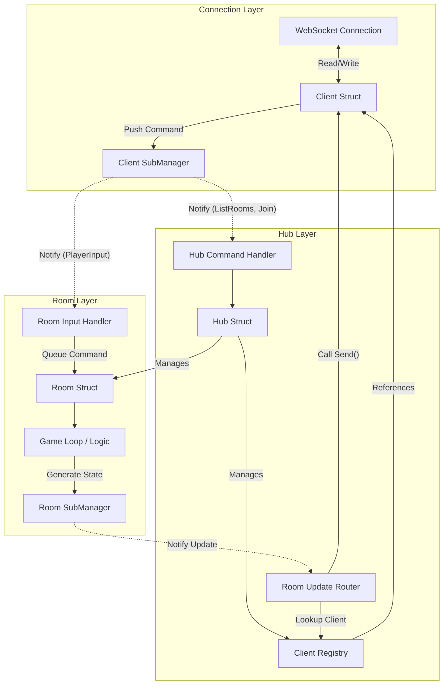

# Survival Game Backend Architecture

This document outlines the architecture of the game server, focusing on the interaction between the **Hub**, **Room**, and **Client** components.

## 1. Core Components

### Client (`services.Client`)
*   **Role**: Represents a connected user (WebSocket).
*   **Responsibilities**:
    *   **Network I/O**: Manages `readPump` (receiving) and `writePump` (sending).
    *   **Protocol**: Handles encoding/decoding of JSON messages.
    *   **Event Dispatch**: Uses a **Subscription System**. When a message arrives, it is pushed to *all* subscribers.
        *   *Note*: Both the Hub and the Room (after joining) subscribe to the Client to receive messages.

### Hub (`services.Hub`)
*   **Role**: The central management unit (Singleton).
*   **Responsibilities**:
    *   **Connection Management**: Holds the `ClientRegistry` of all active connections.
    *   **Room Management**: Creates, holds, and shuts down `Room` instances.
    *   **Global Commands**: Handles commands that don't belong to a specific game, such as `ListRooms` or `JoinRoom`.
    *   **Routing**: Bridges the gap between Rooms and Clients for outgoing messages.

### Room (`services.Room`)
*   **Role**: An isolated game instance.
*   **Responsibilities**:
    *   **Game Loop**: Runs a ticker (e.g., 60Hz) to update game state.
    *   **State Management**: Holds `GameState`, `GameLogic`, and `PlayerRegistry`.
    *   **Input Processing**: Receives `PlayerInput` from players in the room.
    *   **Broadcasting**: Emits `UpdateMessage` (snapshots) to subscribers (usually the Hub's routing handler).

---

## 2. Interaction & Data Flow

### Input Flow (Client -> Server)
The system uses a **Pub/Sub pattern for Inputs**.
1.  **WebSocket** receives data.
2.  **Client** decodes it into a `RequestCommand`.
3.  **Client** notifies all subscribers:
    *   **Hub Subscription**: Checks if the command is `ListRooms` or `JoinRoom`. If yes, executes it.
    *   **Room Subscription** (created upon `JoinRoom`): Checks if the command is `PlayerInput`. If yes, queues it for the next game tick.

### Output Flow (Server -> Client)
The system uses a **Pub/Sub pattern for Outputs** as well.
1.  **Room** game loop finishes a tick and generates a state snapshot.
2.  **Room** publishes an `UpdateMessage` (containing the payload and target session IDs).
3.  **Hub Subscription** (attached to the Room) receives this message.
4.  **Hub** looks up the `Client` for each target session ID in `ClientRegistry`.
5.  **Hub** calls `Client.Send()` to queue the message for the WebSocket.

---

## 3. Architecture Diagram

## 4. Key Design Patterns

*   **Observer Pattern (Subscriptions)**: Used heavily for decoupling. The Client doesn't know about the Hub or Room; it just notifies subscribers. Similarly, the Room doesn't hold direct references to Clients for broadcasting; it notifies the Hub's router.
*   **Command Pattern**: All inputs are encapsulated as `RequestCommand` envelopes.
*   **Actor-like Model**: The Room runs in its own goroutine and communicates primarily via channels (`commands` and `outgoing`), ensuring thread safety for the game state.
